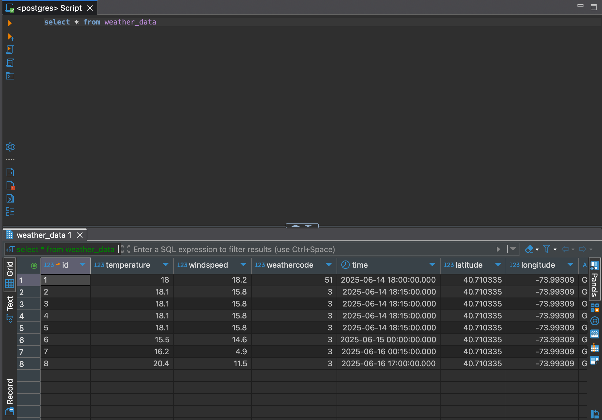

# ETL_Weather_data 🌦️

This project is an ETL pipeline for extracting, transforming, and loading weather data using **Apache Airflow**, built and deployed with **Astronomer (Astro)**.

## 🚀 Overview

- **Extract** weather data from a public weather API (e.g., OpenWeatherMap).
- **Transform** and clean the data.
- **Load** it into a structured storage format for analytics or monitoring.

## ⚙️ Tech Stack

- Apache Airflow (via [Astronomer CLI](https://docs.astronomer.io/astro/cli))
- Docker
- Docker Compose
- Python

 


 


## 🧭 Project Structure

```
ETL_Weather_data/
├── dags/                    # Airflow DAGs
├── tests/dags/             # DAG tests
├── Dockerfile              # Docker image for Astro runtime
├── airflow_settings.yaml   # Predefined Airflow connections/variables
├── requirements.txt        # Python dependencies
├── packages.txt            # OS-level dependencies
├── docker-compose.yml      # (Optional) Local Docker Compose setup
├── .gitignore              # Git ignored files
├── LICENSE                 # License
├── README.md               # This file
```

## 🧰 Astro CLI

### 1. Install Astro CLI (if not already)

Follow the [official installation guide](https://docs.astronomer.io/astro/cli/install-cli).

### 2. Initialize and Start

```bash
astro dev init

astro dev start
```

### 3. Access Airflow

Go to [http://localhost:8080](http://localhost:8080)  
Login: `admin / admin` (default)

## 🔐 Configuration

You can predefine variables and connections in `airflow_settings.yaml`.

## 📦 Dependency Management

To add Python dependencies:

```bash
pip install <package>
poetry add <package>       # If using Poetry
```

## Output

Based on the configuration set in the DAG, The weather data for the given lattitude and Longitude will be updated and stored in PostgreSQL data base. 

### DAG 


### Check the Weather data in the relational database

Any database management system that can show the schema can be used to look into the weather information 

In the current repo `DBeaver` has been used and frozen snapshot of the output is shown below.



